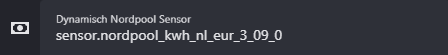

# Dynamisch Energiebeheer - Home Assistant
**Om in 2️⃣ stappen de dynamische tarieven visueel te krijgen in Home Assistant**.

Dit project bevat de configuratie voor het dynamisch aansturen van thuisbatterijen, op basis van Nordpool energieprijzen (HACS) binnen Home Assistant. Visueel aantrekkelijk met een gemakkelijke JA of NEE voor je eigen laad en ontlaad automatiseringen.

Vind je dit project leuk en wil je mij steunen? Trakteer mij dan op een kopje koffie ☕️ – ik codeer beter met cafeïne!

 

## 1️⃣ Configuration.yaml

1. Maak eerst een **backup** van je `configuration.yaml`.
2. Pas daarna je `configuration.yaml` aan door gebruik te maken van de Github `configuration.yaml`.
3. Herstart Home Assistant.
4. Vul nu bij de onderstaande entiteiten de juiste gegevens in en herstart Home Assistant nogmaals.

| Configuratie| Extra info|
|-|-|
| `input_text.dynamisch_nordpool_sensor`      |  de sensor van Nordpool HACS toevoegen |
| `input_text.dynamisch_handmatige_periode`    | Verwijder **unknown** |
| `input_text.dynamisch_handmatige_periode_morgen` | Verwijder **unknown** |

*Zelf toe te voegen entiteiten op een dashboard.

---

#### ✅ Resultaat
Je krijgt twee sensoren die aangeven of een periode **JA** (goedkoop) of **NEE** (duur) is. Op basis hiervan kun je automatisch bijvoorbeeld een batterij aansturen via je eigen automatiseringen.

#### ✅ Attributen bekijken
Je kunt op de indicatie-sensoren klikken om de volledige berekeningen en attributen in te zien. Hier staat ook de code voor de handmatige periode die je vervolgens kunt knippen en plakken om zelf een beetje aan te passen en te gebruiken in het handmatige periode veld.

  

## 2️⃣ Automatisering toevoegen

Voeg de automatisering toe. deze zorgt ervoor dat hij de forecast (morgen) en ingestelde periodes over zal zetten naar vandaag om 00:00. 

  

## #️⃣ Apexcharts
Je kunt om het visueel aantrekkelijk te maken de Apexcharts `Nordpool_Apexcharts_Vandaag` en `Nordpool_Apexcharts_Morgen` gebruiken `(zie Github bestanden)`.
