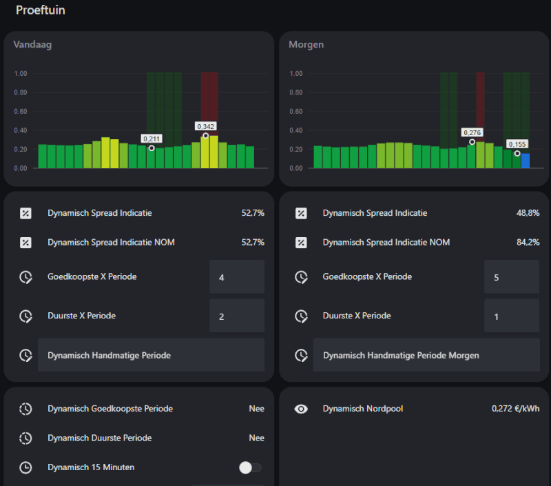
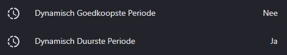
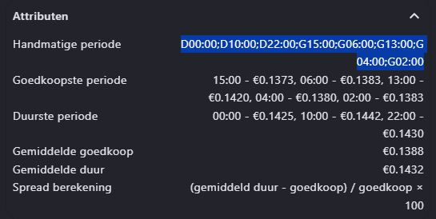

## ⚡ Dynamisch Energiebeheer (Home Assistant)

Dit project bevat de configuratie voor het dynamisch aansturen van thuisbatterijen, op basis van Nordpool energieprijzen (HACS) binnen Home Assistant. Visueel aantrekkelijk met een gemakkelijke JA of NEE voor je eigen laad en ontlaad automatiseringen.

Vind je dit project leuk en wil je mij steunen? Trakteer mij dan op een kopje koffie ☕️ – ik codeer beter met cafeïne!

[![Buy Me a Coffee][buymecoffeebadge]][buymecoffee]

[buymecoffee]: https://www.buymeacoffee.com/gielz
[buymecoffeebadge]: https://www.buymeacoffee.com/assets/img/custom_images/orange_img.png



### 📦 Entiteiten Configuratie

Pas je `configuration.yaml` aan om de benodigde sensoren toe te voegen. Let op: je moet de `sensor.<NORDPOOL>` vervangen door je eigen Nordpool (HACS) sensor (kwartier/kwh tarieven).
> Je vindt deze op 3 locaties bij de `template sensor dynamisch_nordpool`.

### 🔁 Home Assistant herstarten

Na een herstart van Home Assistant moeten de velden:

- `input_text.dynamisch_handmatige_periode`
- `input_text.dynamisch_handmatige_periode_morgen`

handmatig worden aangepast. Verwijder hierbij **`unknown`** eenmalig.

---

#### Resultaat
Je krijgt twee sensoren die aangeven of een periode **JA** (goedkoop) of **NEE** (duur) is. Op basis hiervan kun je automatisch bijvoorbeeld een batterij aansturen via je eigen automatiseringen. In de toekomst zal dit worden opgenomen in https://github.com/Gielz1986/Zendure-zenSDK-HA



#### Attributen bekijken
Je kunt op de indicatie-sensoren klikken om de volledige berekeningen en attributen in te zien. Hier staat ook de code voor de handmatige periode die je vervolgens kunt knippen en plakken om zelf een beetje aan te passen en te gebruiken in het handmatige periode veld.



---

### 🔁 Automatisering toevoegen

Voeg de automatisering toe. deze zorgt ervoor dat hij de forecast en ingestelde periodes over zal zetten naar vandaag om 00:00. 

---

### 📊 ApexCharts Weergave

#### Vandaag
```yaml
type: custom:apexcharts-card
stacked: true
header:
  show: true
  title: Vandaag
experimental:
  color_threshold: true
graph_span: 24h
apex_config:
  plotOptions:
    bar:
      columnWidth: 90%
  tooltip:
    enabledOnSeries:
      - 0
    followCursor: true
    shared: true
    intersect: false
    enabled: true
    x:
      format: HH:mm
      show: false
  grid:
    show: true
    borderColor: "#332f2c"
    strokeDashArray: 0
  chart:
    height: 200px
  yaxis:
    - title:
        text: ""
      decimalsInFloat: 2
      min: 0
      max: 1
      tickAmount: 5
      forceNiceScale: false
      labels:
        style:
          colors: "#7b7c83"
  xaxis:
    labels:
      show: false
    axisTicks:
      show: false
    axisBorder:
      color: "#616269"
  legend:
    show: false
span:
  start: day
series:
  - entity: sensor.dynamisch_nordpool
    yaxis_id: Prijs
    type: column
    color: "#ebebeb"
    float_precision: 3
    color_threshold:
      - value: 0
        color: "#186ddc"
      - value: 0.155
        color: "#04822e"
      - value: 0.2
        color: "#12A141"
      - value: 0.25
        color: "#79B92C"
      - value: 0.3
        color: "#C4D81D"
      - value: 0.35
        color: "#F3DC0C"
      - value: 0.4
        color: "#EFA51E"
      - value: 0.45
        color: "#E76821"
      - value: 0.5
        color: "#DC182F"
    name: Vandaag
    show:
      in_header: false
      legend_value: false
      extremas: true
    data_generator: |
      return entity.attributes.raw_today.map((start, index) => {
        return [new Date(start["start"]).getTime(), entity.attributes.raw_today[index]["value"]];
      });
  - entity: sensor.dynamisch_goedkoopste_periode
    color: green
    curve: stepline
    opacity: 0.2
    type: column
    name: Goedkoop
    data_generator: |
      const data = entity.attributes["raw_today"];
      if (!data) return [];

      return data.map(item => {
        const tijd = new Date(item.start).getTime();
        const waarde = item.goedkoop === "ja" ? 1 : 0;
        return [tijd, waarde];
      });
  - entity: sensor.dynamisch_goedkoopste_periode
    color: red
    curve: stepline
    opacity: 0.2
    type: column
    name: Duur
    data_generator: |
      const data = entity.attributes["raw_today"];
      if (!data) return [];

      return data.map(item => {
        const tijd = new Date(item.start).getTime();
        const waarde = item.duur === "ja" ? 1 : 0;
        return [tijd, waarde];
      });
```

#### Morgen

```yaml
type: custom:apexcharts-card
stacked: true
header:
  show: true
  title: Morgen
experimental:
  color_threshold: true
graph_span: 24h
apex_config:
  noData:
    text: Vanaf 14:00 zijn de prijzen van morgen bekend.
  plotOptions:
    bar:
      columnWidth: 90%
  tooltip:
    enabledOnSeries:
      - 0
    followCursor: true
    shared: true
    intersect: false
    enabled: true
    x:
      format: HH:mm
      show: false
  grid:
    show: true
    borderColor: "#332f2c"
    strokeDashArray: 0
  chart:
    height: 200px
  yaxis:
    - title:
        text: ""
      decimalsInFloat: 2
      min: 0
      max: 1
      tickAmount: 5
      forceNiceScale: false
      labels:
        style:
          colors: "#7b7c83"
  xaxis:
    labels:
      show: false
    axisTicks:
      show: false
    axisBorder:
      color: "#616269"
  legend:
    show: false
span:
  start: day
  offset: +1d
series:
  - entity: sensor.dynamisch_nordpool
    yaxis_id: Prijs
    type: column
    color: "#ebebeb"
    float_precision: 3
    color_threshold:
      - value: 0
        color: "#186ddc"
      - value: 0.155
        color: "#04822e"
      - value: 0.2
        color: "#12A141"
      - value: 0.25
        color: "#79B92C"
      - value: 0.3
        color: "#C4D81D"
      - value: 0.35
        color: "#F3DC0C"
      - value: 0.4
        color: "#EFA51E"
      - value: 0.45
        color: "#E76821"
      - value: 0.5
        color: "#DC182F"
    name: Morgen
    show:
      in_header: false
      legend_value: false
      extremas: true
    data_generator: |
      return entity.attributes.raw_tomorrow.map((start, index) => {
        return [new Date(start["start"]).getTime(), entity.attributes.raw_tomorrow[index]["value"]];
      });
  - entity: sensor.dynamisch_goedkoopste_periode
    color: green
    curve: stepline
    opacity: 0.2
    type: column
    name: Goedkoop
    data_generator: |
      const data = entity.attributes["raw_tomorrow"];
      if (!data) return [];

      return data.map(item => {
        const tijd = new Date(item.start).getTime();
        const waarde = item.goedkoop === "ja" ? 1 : 0;
        return [tijd, waarde];
      });
  - entity: sensor.dynamisch_goedkoopste_periode
    color: red
    curve: stepline
    opacity: 0.2
    type: column
    name: Duur
    data_generator: |
      const data = entity.attributes["raw_tomorrow"];
      if (!data) return [];

      return data.map(item => {
        const tijd = new Date(item.start).getTime();
        const waarde = item.duur === "ja" ? 1 : 0;
        return [tijd, waarde];
      });


```
